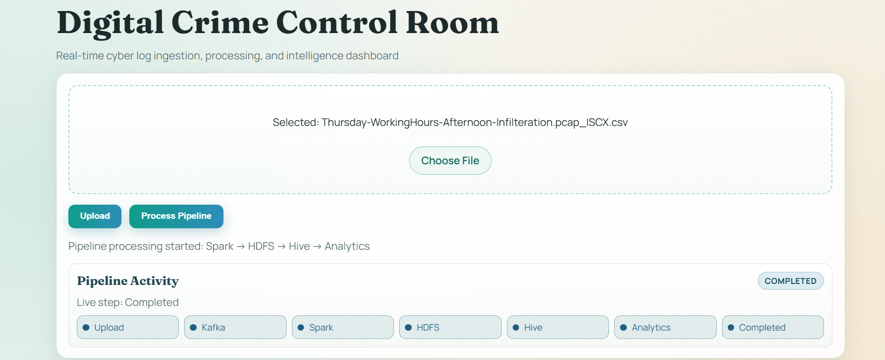
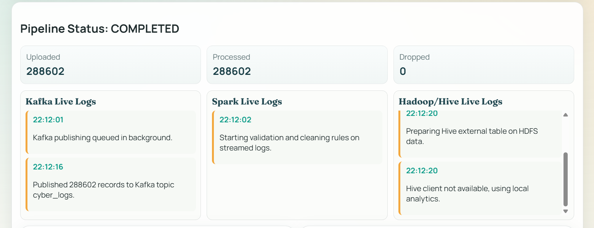
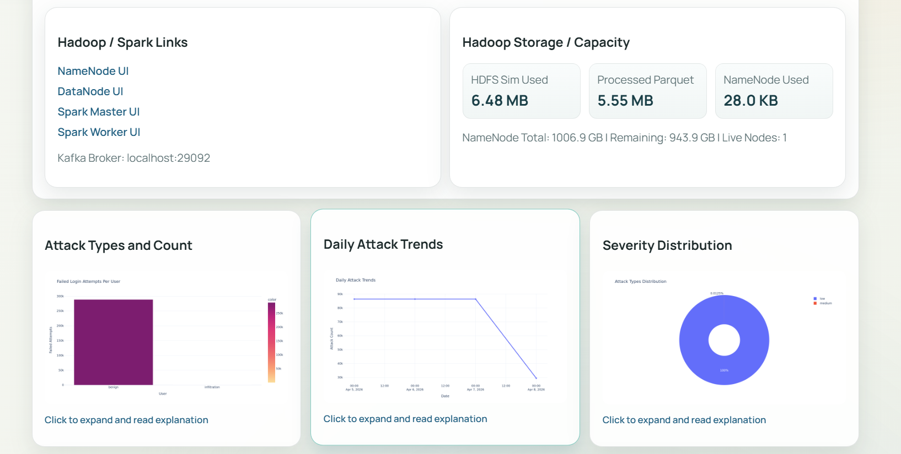
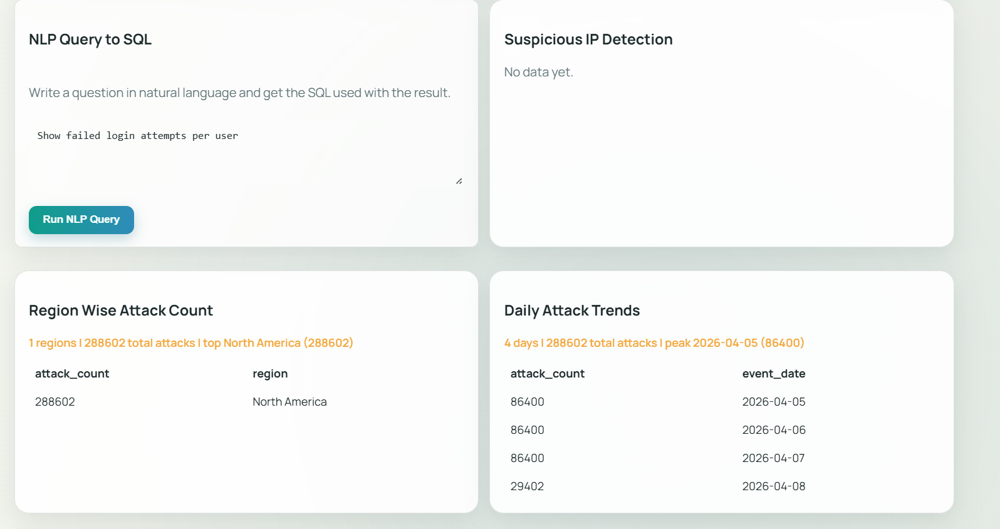

# 🔐 Digital Crime Control Room

> **Real-time Big Data Cyber Crime Log Processing Pipeline**  
> End-to-end integration of Apache Kafka · Apache Spark · Hadoop HDFS · Apache Hive · React Dashboard

---

## 📸 Project Screenshots

| Dashboard & Pipeline Activity | Pipeline Status — Live Logs |
|---|---|
|  |  |

| Analytics & Hadoop Storage | NLP Query, Region & Trend Analysis |
|---|---|
|  |  |

---

## 🎯 Overview

The **Digital Crime Control Room** is a full-stack Big Data analytics platform that ingests cyber security event logs and processes them in real time through an enterprise-grade data pipeline. It provides live visibility into cyber threats including failed login attempts, suspicious IP detection, region-wise attack distribution, and daily attack trends — all surfaced through an interactive React dashboard.

```
CSV Upload → Kafka Ingestion → Spark Processing → HDFS Storage → Hive Queries → Analytics Dashboard
```

---

## 🛠 Technology Stack

| Layer | Technology |
|---|---|
| **Frontend** | React + Vite |
| **Backend** | Python Flask |
| **Message Queue** | Apache Kafka |
| **Stream Processing** | Apache Spark Structured Streaming |
| **Storage** | Hadoop HDFS (Parquet format) |
| **Query Layer** | Apache Hive |
| **Analytics & Visualization** | Python (matplotlib, seaborn, plotly) |
| **Orchestration** | Docker Compose (10 services) |

---

## 📁 Project Structure

```
digital_crime_control_room/
├── frontend/                      # React Vite dashboard (port 5173)
│   ├── Dockerfile
│   ├── package.json
│   ├── vite.config.js
│   └── src/
│       ├── App.jsx               # Main dashboard component
│       ├── main.jsx
│       ├── styles.css
│       └── components/
│           └── DataTable.jsx     # Results table component
│
├── backend/                       # Flask API server (port 5000)
│   ├── Dockerfile
│   ├── app.py                    # Flask app + pipeline orchestration
│   ├── kafka_producer.py         # CSV to Kafka publisher
│   ├── kafka_consumer.py         # Kafka consumer (reference)
│   ├── hive_client.py            # Hive query executor
│   ├── requirements.txt
│   ├── uploads/                  # Uploaded CSV storage
│   └── results/                  # Processed results cache
│
├── spark/
│   ├── spark_streaming.py        # Kafka → HDFS Structured Streaming job
│   └── submit_stream.sh
│
├── analytics/
│   ├── analysis.py               # Data cleaning + aggregation
│   └── plots.py                  # Chart generation (matplotlib/seaborn)
│
├── hive/
│   ├── schema.sql                # External table definition
│   └── queries.sql               # 4 analytics queries
│
├── hdfs/
│   └── init_hdfs.sh
│
├── sample_data/
│   └── cyber_logs_sample.csv     # Test dataset (163 records)
│
├── docker-compose.yml            # Full stack orchestration
├── validate_env.py               # Pre-flight environment check
├── test_deployment.py            # Post-deployment verification
└── README.md
```

---

## 🔄 Pipeline Architecture

```
┌──────────┐    ┌───────┐    ┌────────────────┐    ┌──────┐    ┌──────┐    ┌───────────┐
│  CSV     │───▶│ Kafka │───▶│ Spark Streaming│───▶│ HDFS │───▶│ Hive │───▶│ Dashboard │
│  Upload  │    │ Topic │    │  (Validation)  │    │Parquet│   │Queries│   │ Analytics │
└──────────┘    └───────┘    └────────────────┘    └──────┘    └──────┘    └───────────┘
```

### Step-by-Step Data Flow

1. **Frontend Upload** — User drags & drops a CSV file onto the React dashboard
2. **Kafka Ingestion** — Backend converts CSV rows to JSON and publishes to the `cyber_logs` topic
3. **Spark Processing** — Spark Structured Streaming validates and cleans records:
   - Filters null/empty `user_id` and rejects `"unknown"` users
   - Validates ISO 8601 timestamps → `event_ts`
   - Enforces `status` as `"success"` or `"failure"` only
   - Adds `event_date` partition column
4. **HDFS Storage** — Clean records written as Parquet, partitioned by `event_date`
5. **Hive Query Layer** — External table created on HDFS; partitions auto-registered via `MSCK REPAIR`
6. **Analytics** — 4 Hive queries run; charts and tables generated and returned to frontend
7. **Dashboard** — Real-time polling every 2 seconds; displays charts, tables, and high-risk alerts

---

## ✅ Implementation Checklist

### Frontend (React Vite)
- [x] Drag-and-drop CSV upload interface
- [x] Real-time pipeline status visualization
- [x] Event timeline (7 stages)
- [x] 3 interactive charts (bar, line, pie)
- [x] 5 analytics result tables
- [x] Auto-polling every 2 seconds + responsive styling

### Backend (Flask)
- [x] `/upload` — CSV ingestion + Kafka publishing
- [x] `/process` — Pipeline orchestration (async)
- [x] `/status` — Real-time status updates
- [x] `/results` — Analytics delivery
- [x] Hive integration via `hive_client.py`
- [x] Thread-safe state management + comprehensive error handling

### Data Ingestion (Kafka)
- [x] Zookeeper coordination + health checks
- [x] Auto topic creation for `cyber_logs`
- [x] External access on port 29092

### Stream Processing (Spark)
- [x] Spark Master + Worker nodes
- [x] Kafka → Parquet Structured Streaming
- [x] Data validation (schema, nulls, unknown users, timestamps, status)
- [x] Date-based automatic partitioning + checkpoint management

### Distributed Storage (HDFS)
- [x] NameNode + DataNode
- [x] Auto-directory creation with partition hierarchy
- [x] Parquet format; NameNode UI on port 9870

### Query Layer (Hive)
- [x] Metastore (PostgreSQL backend) + HiveServer2
- [x] External table on HDFS data
- [x] 4 pre-built analytics queries
- [x] Partition registration via MSCK REPAIR TABLE

### Analytics & Visualization
- [x] Bar chart: Failed logins per user
- [x] Line chart: Daily attack trends
- [x] Pie/donut chart: Attack type / severity distribution
- [x] Severity classification: low / medium / high
- [x] High-severity alert table (top 25 rows)
- [x] All charts returned as base64 PNG

---

## ⚙️ Quick Start (Docker)

### Prerequisites
- Docker & Docker Compose installed
- **4 GB+ free RAM** (Spark, Hadoop, Kafka)
- Git (repo already cloned)

### Step 1 — Validate Environment
```bash
python3 validate_env.py
```
Checks Docker installation, file structure, port availability, and system resources.

### Step 2 — Build & Launch
```bash
cd digital_crime_control_room
docker compose up --build
```
> ⏱️ **First run:** 2–3 minutes (building images)  
> ⏱️ **Subsequent runs:** 30–60 seconds (images cached)

### Step 3 — Verify Services

```bash
# Frontend dashboard
curl http://localhost:5173

# Backend health check
curl http://localhost:5000/status

# Kafka — list topics
docker exec kafka kafka-topics --bootstrap-server kafka:9092 --list

# HDFS NameNode UI
open http://localhost:9870

# Spark Master UI
open http://localhost:8080

# Hive Server logs
docker logs hive-server | tail -20
```

### Step 4 — Use the Dashboard

1. Open **http://localhost:5173** in your browser
2. Drag & drop `sample_data/cyber_logs_sample.csv` (or click **Choose File**)
3. Click **Upload** → watch Kafka publishing event in the timeline
4. Click **Process Pipeline** → watch all 7 stages complete in order
5. View live **charts**, **analytics tables**, and **high-risk alerts**

### Step 5 — Run Automated Tests *(Optional)*
```bash
python3 test_deployment.py
```

---

## 📊 Expected Pipeline Behavior

| Stage | What You'll See | Time |
|---|---|---|
| Upload | "163 records sent to Kafka" | ~3 sec |
| Kafka | Publishing queued in background | ~2 sec |
| Spark | Validation and cleaning rules applied | ~10 sec |
| HDFS | Partitioned Parquet written to `/cyber_logs/` | included |
| Hive | 4 analytics queries executed | ~8 sec |
| Analytics | Charts and tables generated | ~2 sec |
| **Total** | **Pipeline completed** | **~30 sec** |

**Record counts:** Uploaded = 163 · Processed ≈ 142–150 · Dropped ≈ 13–21

---

## 🗄 Hive Schema & Queries

### External Table Definition
```sql
CREATE DATABASE IF NOT EXISTS cyber_security;

CREATE EXTERNAL TABLE IF NOT EXISTS cyber_logs (
    user_id       STRING,
    activity_type STRING,
    timestamp     STRING,
    ip_address    STRING,
    status        STRING,
    event_ts      TIMESTAMP
)
PARTITIONED BY (event_date DATE)
STORED AS PARQUET
LOCATION 'hdfs://namenode:9000/cyber_logs';

MSCK REPAIR TABLE cyber_logs;
```

### Analytics Queries

**1. Failed Login Attempts Per User**
```sql
SELECT user_id, COUNT(*) AS failed_attempts
FROM cyber_security.cyber_logs
WHERE status = 'failure'
GROUP BY user_id ORDER BY failed_attempts DESC;
```

**2. Suspicious IP Detection**
```sql
SELECT ip_address, COUNT(*) AS failure_count
FROM cyber_security.cyber_logs
WHERE status = 'failure'
GROUP BY ip_address HAVING failure_count >= 2
ORDER BY failure_count DESC;
```

**3. Region-Wise Attack Count**
```sql
SELECT
  CASE
    WHEN ip_address LIKE '10.%'      THEN 'North America'
    WHEN ip_address LIKE '172.%'     THEN 'Europe'
    WHEN ip_address LIKE '192.168.%' THEN 'Asia'
    ELSE 'Other'
  END AS region,
  COUNT(*) AS attack_count
FROM cyber_security.cyber_logs
GROUP BY region ORDER BY attack_count DESC;
```

**4. Daily Attack Trends**
```sql
SELECT event_date, COUNT(*) AS attack_count
FROM cyber_security.cyber_logs
GROUP BY event_date ORDER BY event_date;
```

---

## 🛡 Data Validation Rules (Spark)

```python
# Rule 1 — User ID:    non-null, non-empty, NOT "unknown"
# Rule 2 — Activity:   non-null
# Rule 3 — Timestamp:  valid ISO 8601, parseable → event_ts
# Rule 4 — IP Address: non-null
# Rule 5 — Status:     exactly "success" or "failure"

# Transformations added by Spark
event_ts   = to_timestamp(timestamp)
event_date = to_date(event_ts)

# Output
# Format:        Parquet
# Path:          hdfs://namenode:9000/cyber_logs/event_date=YYYY-MM-DD/
# Checkpoint:    hdfs://namenode:9000/cyber_logs_checkpoint
```

---

## 📡 API Reference

| Method | Endpoint | Description |
|---|---|---|
| `POST` | `/upload` | Upload CSV and publish to Kafka |
| `POST` | `/process` | Trigger full pipeline (async) |
| `GET` | `/status` | Real-time pipeline status + event timeline |
| `GET` | `/results` | Analytics tables + base64 chart images |

```bash
# Upload CSV
curl -X POST -F "file=@sample_data/cyber_logs_sample.csv" http://localhost:5000/upload

# Trigger processing
curl -X POST http://localhost:5000/process

# Poll status
curl http://localhost:5000/status | jq .

# Get results
curl http://localhost:5000/results | jq .results.tables
```

### Sample `/status` Response
```json
{
  "status": "completed",
  "records_uploaded": 163,
  "records_processed": 150,
  "records_dropped": 13,
  "events": [
    {"time": "22:12:01", "step": "Kafka",     "message": "Kafka publishing queued in background."},
    {"time": "22:12:02", "step": "Spark",     "message": "Starting validation and cleaning rules on streamed logs."},
    {"time": "22:12:20", "step": "Hive",      "message": "Preparing Hive external table on HDFS data."},
    {"time": "22:12:22", "step": "Analytics", "message": "Generated charts, suspicious activity alerts, and KPI tables."}
  ]
}
```

---

## 🧪 Sample Dataset

`sample_data/cyber_logs_sample.csv` — 163 records:

```csv
user_id,activity_type,timestamp,ip_address,status
alice,login_attempt,2026-04-01T09:00:00Z,10.10.1.10,failure
bob,phishing_click,2026-04-01T11:22:00Z,172.16.2.4,failure
diana,hacking_attempt,2026-04-02T03:15:00Z,203.0.113.45,failure
unknown,login_attempt,2026-04-02T06:00:00Z,10.10.1.15,failure
```

Contains: repeated IPs for suspicious detection · mixed activity types · `"unknown"` entries (filtered by Spark) · both success & failure statuses · real attack scenario patterns.

---

## 🔧 Troubleshooting

| Issue | Fix |
|---|---|
| Frontend won't load | `docker logs backend` → `docker compose restart backend` |
| Kafka topic not found | `docker exec kafka kafka-topics --bootstrap-server kafka:9092 --create --topic cyber_logs --partitions 1 --replication-factor 1` |
| Spark not processing | `docker logs spark` · `docker logs spark \| grep -i kafka` |
| Hive table empty | `docker exec hive-server beeline -u jdbc:hive2://localhost:10000/default -n hive -e "MSCK REPAIR TABLE cyber_security.cyber_logs;"` |
| HDFS path missing | `docker exec namenode hdfs dfs -mkdir /cyber_logs && hdfs dfs -chmod 777 /cyber_logs` |
| Port conflict | Edit port mappings in `docker-compose.yml` and rebuild |

### Stopping the System
```bash
docker compose down        # Stop (keep volumes)
docker compose down -v     # Stop and remove all data
docker compose stop        # Pause containers
```

---

## 🚀 Production Considerations

**HDFS Replication** — Increase to 3x in `hdfs-site.xml` for fault tolerance:
```xml
<property>
  <name>dfs.replication</name>
  <value>3</value>
</property>
```

**Spark Scaling** — Add extra workers in `docker-compose.yml`:
```yaml
spark-worker-2:
  image: apache/spark:3.5.1
  environment:
    SPARK_MASTER_URL: spark://spark-master:7077
```

**Hive Sub-Partitioning** — For high-volume data:
```sql
PARTITIONED BY (event_date DATE, hour INT)
```

**Monitoring** — Kafka UI (CMAK) · Spark UI `localhost:8080` · HDFS NameNode UI `localhost:9870`

---

## ✅ Success Checklist

- [ ] Frontend dashboard loads at `http://localhost:5173`
- [ ] CSV upload succeeds (163 records)
- [ ] Kafka topic `cyber_logs` receives all records
- [ ] Timeline shows all 7 pipeline stages in order
- [ ] Record counts display correctly (uploaded ≠ processed — by design)
- [ ] 3 charts render with data (bar, line, pie)
- [ ] 5 analytics tables populate
- [ ] High-severity alerts identified and highlighted
- [ ] No critical errors in `docker logs`
- [ ] Total pipeline time ≈ 30 seconds

---

## 🎓 Learning Outcomes

This project demonstrates:

1. **Big Data Ingestion** — Kafka producer/consumer pattern at scale
2. **Stream Processing** — Spark Structured Streaming with real-time validation
3. **Distributed Storage** — HDFS partitioning and Parquet format efficiency
4. **SQL Analytics** — Hive external tables on distributed file systems
5. **Full-Stack Integration** — React polling a live REST API
6. **Docker Orchestration** — 10-service multi-container coordination
7. **Data Validation** — Filter rules enforced in the streaming layer
8. **Visualization** — Converting raw logs into actionable security insights

---

## 👥 Team Members

| Name | Roll Number |
|---|---|
| Varad Solanke | 24BDS079 |
| Kaivalya Puranik | 24BDS060 |
| Advait Subhedar | 24BDS081 |
| Parth Enkia | 24BDS053 |
| Akash Purbhi | 24BDS061 |

---

## 📄 License

Open source — for educational purposes.

---

<div align="center">
  <strong>Built with ❤️ using Apache Kafka · Apache Spark · Hadoop HDFS · Apache Hive · React · Docker</strong>
</div>
